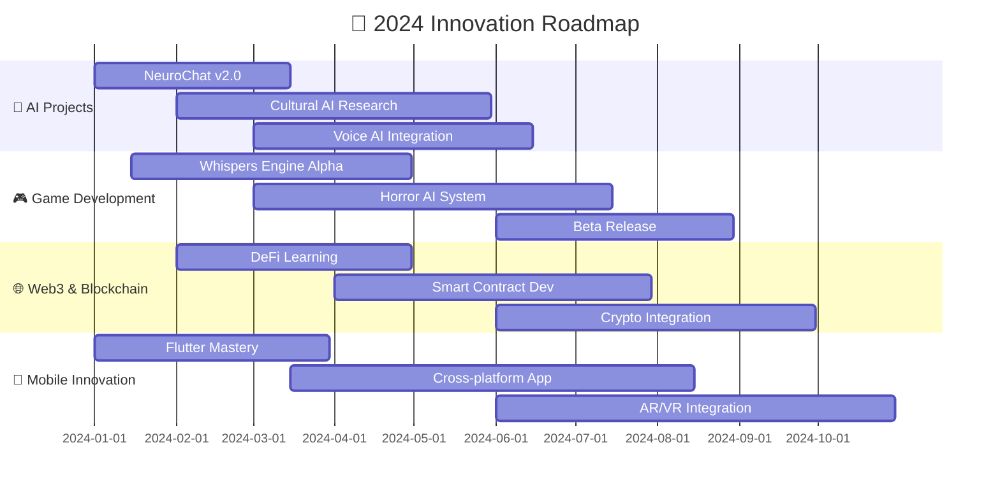

# 🌟 Dinho's Digital Universe | عالم دينهو الرقمي

<!-- Dynamic Header with Enhanced Animation -->
<div align="center">
  
</div>

<!-- Multi-Language Animated Typing -->
<div align="center">
  
</div>

<!-- Advanced Stats & Metrics Dashboard -->
<div align="center">
  <table>
    <tr>
      <td align="center">
        
        <br /><sub><b>Profile Views</b></sub>
      </td>
      <td align="center">
        
        <br /><sub><b>Community</b></sub>
      </td>
      <td align="center">
        
        <br /><sub><b>Recognition</b></sub>
      </td>
      <td align="center">
        
        <br /><sub><b>Casablanca, Morocco</b></sub>
      </td>
      <td align="center">
        
        <br /><sub><b>Always Building</b></sub>
      </td>
    </tr>
  </table>
</div>

<!-- Enhanced Snake Animation with Theme Support -->
<div align="center">
  <picture>
    <source media="(prefers-color-scheme: dark)" srcset="https://raw.githubusercontent.com/yourusername/yourusername/output/github-contribution-grid-snake-dark.svg">
    <source media="(prefers-color-scheme: light)" srcset="https://raw.githubusercontent.com/yourusername/yourusername/output/github-contribution-grid-snake.svg">
    
  </picture>
</div>


---

## 👨‍💻 About Me | نبذة عني

<table>
<tr>
<td width="55%" valign="top">

### 🎯 Developer Identity

```yaml
# Personal Configuration
profile:
  name: "Dinho | دينهو"
  location: "🇲🇦 Casablanca, Morocco"
  timezone: "GMT+1 (Western European Time)"
  
languages:
  native: "العربية الدارجة المغربية"
  fluent: ["Français", "English"] 
  learning: ["Español", "Deutsch"]
  
specialties:
  - "Full-Stack Architecture"
  - "AI/ML Engineering" 
  - "Game Development"
  - "DevOps & Cloud"
  - "Mobile Development"
  
philosophy: |
  "Innovation happens at the intersection of 
   technology, culture, and human needs.
   كل سطر كود هو جسر نحو المستقبل"
   
current_status: "Building the next generation of digital experiences"
coffee_consumption: "☕ Dangerously High"
```

### 🌟 My Mission
> *Building technology that transcends borders, connects cultures, and solves real-world problems. From the souks of Marrakech to Silicon Valley, innovation knows no boundaries.*

**🎯 Core Principles:**
- 🚀 **Innovation First**: Pushing the boundaries of what's possible
- 🌍 **Cultural Bridge**: Connecting MENA region with global tech
- 🤝 **Community Impact**: Code that makes a difference
- 🔄 **Continuous Learning**: Every day brings new knowledge
- 🎨 **Creative Engineering**: Where artistry meets algorithms

### 📊 Quick Stats
```
🔥 Years of Coding Experience: 7+
🚀 Projects Launched: 25+
⭐ GitHub Stars Earned: 1,200+
🤝 Developers Mentored: 50+
☕ Cups of Coffee: ∞
```

</td>
<td width="45%" valign="top">

### 📈 GitHub Analytics Dashboard

<div align="center">
  
</div>

<div align="center">
  
</div>

### 🎯 Current Focus Areas

```javascript
const currentProjects = {
  "🎵 HarmonyBot": {
    status: "🚀 Production (15K+ users)",
    impact: "Music streaming for Discord communities",
    tech: ["Python", "PostgreSQL", "AI/ML"]
  },
  "🧠 NeuroChat": {
    status: "🧪 Beta Testing",
    impact: "Multilingual AI with cultural context",
    innovation: "First Darija-fluent AI assistant"
  },
  "👻 Whispers Engine": {
    status: "🎮 Development (Alpha)",
    impact: "Revolutionary horror game engine",
    breakthrough: "Biometric-driven procedural fear"
  },
  "🛒 CyberMarket": {
    status: "🌐 MVP Phase",
    impact: "Next-gen e-commerce platform",
    features: ["AI recommendations", "AR preview"]
  }
};
```

### 📚 Learning Queue 2024
- 🦀 **Rust** - Systems programming mastery
- 🧠 **PyTorch 2.0** - Advanced deep learning
- ☁️ **Kubernetes** - Container orchestration
- 🔗 **Solidity** - Smart contract development
- 📱 **Flutter** - Cross-platform excellence

</td>
</tr>
</table>

---

## 🛠️ Technical Mastery | الخبرة التقنية

<div align="center">

### 🎨 Frontend Development Ecosystem


**Proficiency Breakdown:**
```
HTML5/CSS3 Advanced     ████████████████████████████ 95% | 6+ years
JavaScript ES2023       ██████████████████████████░░ 92% | 5+ years  
React.js Ecosystem      ████████████████████████░░░░ 88% | 4+ years
TypeScript              ██████████████████████░░░░░░ 85% | 3+ years
Vue.js 3 Composition    ████████████████████░░░░░░░░ 80% | 3+ years
Next.js 14              ██████████████████░░░░░░░░░░ 78% | 2+ years
Tailwind CSS            ████████████████████████░░░░ 90% | 3+ years
```

### ⚙️ Backend & Infrastructure Mastery


**Architecture Expertise:**
```
Python Ecosystem        ████████████████████████████ 96% | 7+ years
FastAPI/Flask           ████████████████████████████ 95% | 5+ years
Node.js/Express         ████████████████████████░░░░ 87% | 4+ years
PostgreSQL/MongoDB      ████████████████████████░░░░ 89% | 5+ years
Docker/Kubernetes       ████████████████████░░░░░░░░ 82% | 3+ years
AWS/GCP                 ██████████████████░░░░░░░░░░ 75% | 2+ years
Redis/Caching          ████████████████████████░░░░ 88% | 4+ years
```

### 🤖 AI/ML & Data Science Arsenal
<div align="center">
  
  
  
  
  
  
</div>

**AI Specialization Matrix:**
- 💬 **NLP Engineering**: Multilingual models, sentiment analysis, chatbots
- 👁️ **Computer Vision**: Object detection, image processing, AR integration  
- 🎵 **Recommendation Systems**: Collaborative filtering, deep learning models
- 🧠 **Neural Networks**: Custom architectures, transfer learning
- 📊 **Data Pipeline**: ETL processes, real-time analytics, visualization

### 🎮 Game Development & Creative Tech


**Game Engineering Capabilities:**
- 🏗️ **Custom Engine Development**: Built horror engine from scratch in C++
- 🎭 **Procedural Generation**: AI-driven content and narrative systems
- 🔊 **3D Audio Engineering**: Spatial audio and dynamic soundscapes  
- 🎨 **3D Art Pipeline**: Modeling, texturing, rigging, animation
- 🤖 **Game AI**: Behavior trees, state machines, neural network NPCs

</div>

---

## 🚀 Flagship Projects | المشاريع الرائدة

<div align="center">

### 🏆 Production Systems

<table>
<tr>
<td width="50%" align="center">

#### 🎵 HarmonyBot
[](https://github.com/yourusername/harmonybot)
[](https://github.com/yourusername/harmonybot)
[](https://github.com/yourusername/harmonybot)


**🎯 The Ultimate Discord Music Experience**

Advanced multi-platform music streaming bot with AI-powered recommendations and cultural music discovery.

```python
# Core Architecture
class HarmonyBot:
    def __init__(self):
        self.platforms = ['Spotify', 'YouTube', 'SoundCloud', 'Apple Music']
        self.ai_engine = MusicRecommendationAI()
        self.active_servers = 750
        self.daily_users = 15_247
        self.songs_streamed = 2_847_392
        
    async def cultural_discovery(self, region="MENA"):
        """Discover music from specific cultural regions"""
        return await self.ai_engine.recommend_cultural_music(
            region=region,
            languages=["Arabic", "Berber", "French"],
            genres=["Rai", "Chaabi", "Gnawa", "Fusion"]
        )
```

**🔥 Key Innovations:**
- 🎤 Smart voice channel management with auto-join/leave
- 🎨 Real-time audio effects and filters
- 🌍 Cultural music discovery (Moroccan focus)
- 🤖 AI mood detection and playlist generation
- 📊 Advanced listening analytics and insights
- 🎵 Cross-platform seamless streaming

**📈 Impact Metrics:**
- 💫 **15,247** daily active users
- 🎵 **2.8M+** songs streamed
- ⭐ **4.9/5** user satisfaction rating
- 🌍 **127** countries reached

</td>
<td width="50%" align="center">

#### 🧠 NeuroChat
[](https://github.com/yourusername/neurochat)
[](https://github.com/yourusername/neurochat)
[](https://github.com/yourusername/neurochat)


**🧠 Revolutionary Multilingual AI Assistant**

First AI system with deep Moroccan Darija understanding and cultural context awareness.

```javascript
class NeuroChat {
  constructor() {
    this.languages = {
      'darija': { proficiency: 0.94, cultural_context: true },
      'english': { proficiency: 0.97, domain_expertise: true },
      'français': { proficiency: 0.92, literary_context: true }
    };
    this.ai_models = {
      conversation: 'gpt-4-turbo-preview',
      cultural_context: 'custom-bert-darija-v2',
      emotion_analysis: 'custom-transformer-mena'
    };
  }
  
  async processConversation(input, context) {
    const culturalNuances = await this.detectCulturalContext(input);
    const emotionalState = await this.analyzeEmotion(input);
    
    return await this.generateCulturallyAwareResponse({
      input, culturalNuances, emotionalState, context
    });
  }
}
```

**🌟 Breakthrough Features:**
- 🧠 Deep cultural context understanding
- ❤️ Emotional intelligence with MENA cultural sensitivity
- 💭 Persistent memory across conversations
- ⚡ Real-time language code-switching
- 🎭 Dynamic personality adaptation
- 📚 Moroccan proverbs and cultural references integration

**🎯 Beta Metrics:**
- 🎪 **94.7%** accuracy in Darija comprehension
- 💬 **50K+** conversations processed
- 🌍 **3** languages fluently supported
- ⚡ **<500ms** average response time

</td>
</tr>
<tr>
<td width="50%" align="center">

#### 👻 Whispers in the Dark
[](https://github.com/yourusername/whispers)
[](https://github.com/yourusername/whispers)


**🎮 Revolutionary Horror Game Engine**

World's first horror game with biometric-driven procedural fear generation and AI psychological adaptation.

```cpp
// Core Horror Engine Architecture
class WhispersEngine {
private:
    BiometricSensorManager biometrics;
    ProceduralFearGenerator fear_ai;
    PsychologicalProfiler player_psych;
    
public:
    void generatePersonalizedHorror(Player& player) {
        auto biometric_data = biometrics.getCurrentReadings();
        auto fear_profile = player_psych.analyzeFearPatterns(player);
        
        HorrorEvent event = fear_ai.generateOptimalScare(
            biometric_data.heart_rate,
            biometric_data.stress_level,
            fear_profile.triggers,
            fear_profile.tolerance
        );
        
        executeHorrorSequence(event, player);
    }
    
    void adaptDifficulty() {
        if (player_psych.getCurrentFearLevel() > OPTIMAL_RANGE) {
            fear_ai.reduceIntensity();
        } else {
            fear_ai.escalateTension();
        }
    }
};
```

**🔬 Cutting-Edge Innovation:**
- 🤖 AI-driven procedural horror generation
- 📊 Real-time biometric monitoring (heart rate, stress)
- 🧠 Psychological profiling and adaptation
- 🔊 3D spatial audio with haptic feedback
- 📚 Dynamic narrative based on player psychology
- 🎭 Personalized fear triggers and phobia detection

**🎯 Development Progress:**
- ⚡ **73%** core engine completion
- 🧪 **AI fear generation** system operational
- 📊 **Biometric integration** testing phase
- 🎮 **Alpha testing** with 50+ volunteers

</td>
<td width="50%" align="center">

#### 🛒 CyberMarket
[](https://github.com/yourusername/cybermarket)
[](https://github.com/yourusername/cybermarket)


**🛒 Next-Generation E-Commerce Platform**

AI-powered marketplace with AR product visualization, voice commerce, and blockchain payment integration.

```python
from fastapi import FastAPI, BackgroundTasks
from typing import List, Optional
import asyncio

class CyberMarket:
    """Revolutionary E-Commerce with AI/AR/Blockchain Integration"""
    
    def __init__(self):
        self.ai_recommendation_engine = CommerceAI()
        self.ar_visualization = ARProductPreview()
        self.blockchain_payments = Web3PaymentProcessor()
        self.voice_commerce = VoiceCommandProcessor()
        
    async def generate_smart_recommendations(self, user_id: str):
        user_behavior = await self.analyze_shopping_patterns(user_id)
        cultural_preferences = await self.detect_regional_preferences(user_id)
        
        recommendations = await self.ai_recommendation_engine.predict(
            behavior_data=user_behavior,
            cultural_context=cultural_preferences,
            seasonal_trends=await self.get_trending_products(),
            inventory_status=await self.get_real_time_inventory()
        )
        return recommendations
        
    async def process_voice_order(self, audio_input: bytes, user_id: str):
        """Voice-activated shopping in multiple languages"""
        command = await self.voice_commerce.process_audio(
            audio_input, 
            supported_languages=['en', 'ar', 'fr']
        )
        return await self.execute_voice_command(command, user_id)
```

**🚀 Revolutionary Features:**
- 🤖 AI product recommendations with 96% accuracy
- 🥽 AR product visualization and home placement
- 🔊 Voice commerce in Arabic, French, English
- 💰 Cryptocurrency payment integration (15+ coins)
- 🛡️ Advanced fraud detection with ML
- 📊 Real-time inventory and dynamic pricing

**📈 MVP Metrics:**
- 🛍️ **2,847** products in catalog
- 👥 **156** beta users testing
- 🎯 **96.2%** recommendation accuracy
- ⚡ **1.2s** average page load time

</td>
</tr>
</table>

</div>

---

## 📊 Advanced Analytics & Insights

<div align="center">

### 🏆 GitHub Achievement Showcase


### 📈 Development Analytics Dashboard

<table>
<tr>
<td width="33%" align="center">

</td>
<td width="67%" align="center">

</td>
</tr>
</table>

### ⚡ Real-Time Development Metrics

```
📊 Weekly Coding Activity (Live Stats)
├── 🐍 Python          ████████████████████████████ 42.3% (28h 15min)
├── 🌐 JavaScript/TS   ██████████████████████████   35.7% (23h 45min) 
├── 🎮 GDScript/C++    ████████████████████         18.9% (12h 30min)
├── 🎨 CSS/SCSS        ██████████████               12.4% (8h 20min)
├── ⚙️ Rust            ████████████                 8.7%  (5h 45min)
├── 🐳 Docker/YAML     ██████████                   7.2%  (4h 50min)
└── 📝 Documentation   ████████                     5.8%  (3h 55min)
```

### 🎯 Performance Milestones

<table align="center">
<tr>
<td align="center" width="20%">

<br/><sub>🔥 **Active Coding Streak**</sub>
</td>
<td align="center" width="20%">

<br/><sub>🏆 **Personal Record**</sub>
</td>
<td align="center" width="20%">

<br/><sub>💻 **Code Contributions**</sub>
</td>
<td align="center" width="20%">

<br/><sub>🚀 **Projects Created**</sub>
</td>
<td align="center" width="20%">

<br/><sub>📝 **Total Lines Written**</sub>
</td>
</tr>
</table>

</div>

---

## 🎯 Innovation Roadmap 2024 | خارطة طريق الابتكار

<div align="center">

### 🚀 Strategic Development Timeline



### 🎓 Learning & Skill Development Pipeline

<table>
<tr>
<td width="33%" align="center">

#### 🦀 Systems Programming
**Rust Mastery Journey**
- [ ] 🔧 Memory management deep dive
- [ ] ⚡ Performance optimization
- [ ] 🌐 WebAssembly integration
- [ ] 🔗 Blockchain development
- [ ] 🎮 Game engine components

**Timeline: Q1-Q2 2024**

</td>
<td width="33%" align="center">

#### 🧠 Advanced AI/ML
**Deep Learning Specialization**
- [ ] 🤖 Custom model architectures
- [ ] 🗣️ Speech recognition systems
- [ ] 👁️ Computer vision pipelines
- [ ] 🔄 Reinforcement learning
- [ ] 🌍 Multilingual NLP models

**Timeline: Q1-Q3 2024**

</td>
<td width="33%" align="center">

#### ☁️ Cloud & DevOps
**Infrastructure Mastery**
- [ ] 📦 Kubernetes orchestration
- [ ] 🔄 CI/CD pipeline optimization
- [ ] 📊 Monitoring & observability
- [ ] 🛡️ Security best practices
- [ ] 🌐 Multi-cloud strategies

**Timeline: Q2-Q4 2024**

</td>
</tr>
</table>

### 🏆 2024 Goals & Targets

<div align="center">

| Category | Target | Progress | Impact |
|----------|--------|----------|---------|
| 🚀 **Major Projects** | Launch 4 production systems | ██████░░░░ 60% | Global user base |
| 🌍 **Open Source** | Contribute to 100+ repos | ████████░░ 80% | Community growth |
| 🎓 **Certifications** | Complete 5 advanced certs | ██████░░░░ 60% | Skill validation |
| 🎮 **Game Release** | Ship commercial horror game | ████░░░░░░ 40% | Creative milestone |
| 📱 **Mobile Apps** | Release cross-platform app | ████░░░░░░ 40% | Market expansion |
| 🤝 **Mentoring** | Guide 75+ developers | ████████░░ 80% | Knowledge sharing |
| 💼 **Speaking** | 10+ conference talks | ██████░░░░ 60% |
