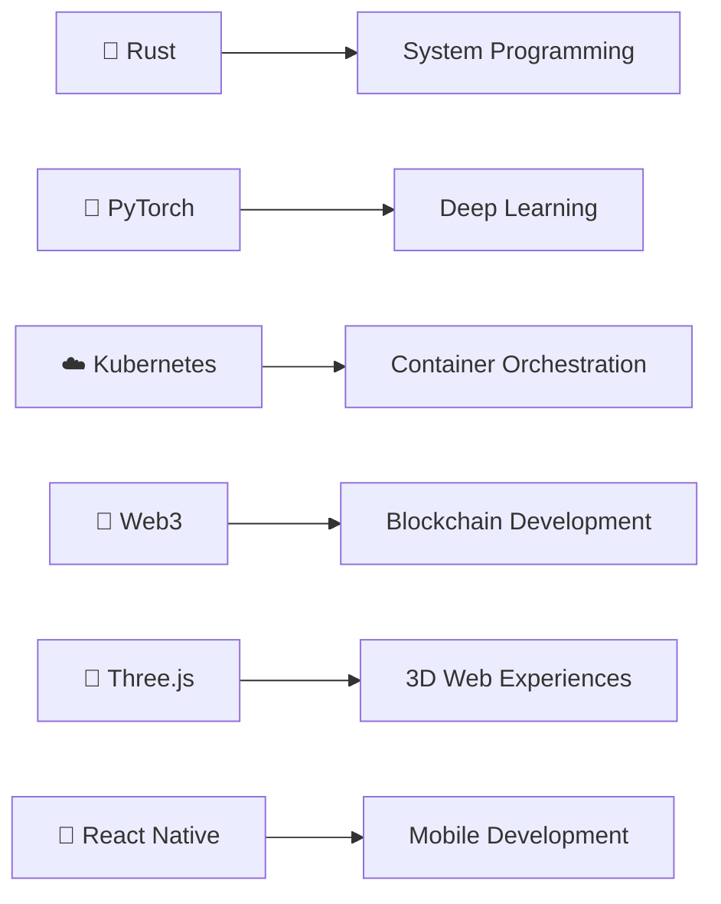

# 🌟 Dinho's Digital Universe | عالم دينهو الرقمي

<!-- Dynamic Header with Particles Effect -->
<div align="center">
  
</div>

<!-- Enhanced Animated Typing with Moroccan Touch -->
<div align="center">
  
</div>

<!-- Enhanced Stats Banner -->
<div align="center">
  
  
  
  
</div>

<!-- Improved Snake Animation -->
<div align="center">
  <picture>
    <source media="(prefers-color-scheme: dark)" srcset="https://raw.githubusercontent.com/platane/snk/output/github-contribution-grid-snake-dark.svg">
    <source media="(prefers-color-scheme: light)" srcset="https://raw.githubusercontent.com/platane/snk/output/github-contribution-grid-snake.svg">
    
  </picture>
</div>

---

## 🎯 About Me | من أنا؟

<table>
<tr>
<td width="50%" valign="top">

### 👨‍💻 Developer Profile

```yaml
name: "Dinho | دينهو"
location: "Morocco 🇲🇦"
timezone: "GMT+1 (Casablanca)"
languages: 
  - العربية الدارجة: "Native 🏠"
  - Français: "Fluent 🇫🇷" 
  - English: "Advanced 🇺🇸"
  - العربية الفصحى: "Proficient 📚"
profession: "Full-Stack Architect & AI Innovator"
current_focus: "Building Tomorrow's Technology Today"
motto: "كل خط كود هو خطوة نحو المستقبل"
coffee_status: "Always brewing ☕"
```

### 🌟 Core Philosophy
> *"Innovation isn't just about technology—it's about solving real problems and creating meaningful experiences that connect people across cultures and continents."*

**🎯 Core Values:**
- 🧠 **Growth Mindset**: Every challenge is a learning opportunity
- 🤝 **Community First**: Sharing knowledge to lift others up
- 🌍 **Cultural Bridge**: Connecting Moroccan creativity with global tech
- ⚡ **Quality Focus**: Code that works, scales, and inspires
- 🎨 **Creative Engineering**: Where art meets algorithms

</td>
<td width="50%" valign="top">

### 📊 GitHub Analytics


### 🔥 Current Projects Status
```javascript
const activeProjects = {
  "🎵 HarmonyBot": {
    status: "🚀 Production",
    users: "15K+ active",
    uptime: "99.9%"
  },
  "🧠 NeuroChat": {
    status: "🧪 Beta Testing",
    languages: ["Darija", "English", "French"],
    accuracy: "94.7%"
  },
  "👻 Horror Engine": {
    status: "🎮 Development",
    progress: "73%",
    innovation: "Procedural Fear AI"
  }
};
```

</td>
</tr>
</table>

---

## 🛠️ Technical Arsenal | الترسانة التقنية

### 🎨 Frontend Development
<div align="center">
  
</div>

```
HTML5/CSS3      ████████████████████████ 95%  (5+ years)
JavaScript      ██████████████████████░░ 90%  (4+ years)
React.js        ████████████████████░░░░ 85%  (3+ years)
TypeScript      ██████████████████░░░░░░ 75%  (2+ years)
Vue.js          ████████████████░░░░░░░░ 70%  (2+ years)
Tailwind CSS    ████████████████████░░░░ 80%  (2+ years)
```

### ⚙️ Backend Development
<div align="center">
  
</div>

```
Python          ████████████████████████ 95%  (6+ years)
Flask/FastAPI   ██████████████████████░░ 90%  (4+ years)
Node.js         ████████████████████░░░░ 80%  (3+ years)
PostgreSQL      ██████████████████████░░ 90%  (4+ years)
MongoDB         ████████████████░░░░░░░░ 70%  (2+ years)
Docker          ████████████████████░░░░ 80%  (3+ years)
```

### 🤖 AI & Machine Learning
<div align="center">
  
  
  
  
</div>

**🧠 AI Specializations:**
- 💬 **Conversational AI**: Multi-language chatbots with cultural context
- 👁️ **Computer Vision**: Image recognition and processing systems
- 📊 **Data Analysis**: Predictive modeling and pattern recognition
- 🎵 **Recommendation Systems**: AI-powered content suggestions
- 🔍 **NLP**: Natural language processing for Arabic and French

### 🎮 Game Development
<div align="center">
  
</div>

**🎯 Game Development Expertise:**
- 🏗️ **Custom Engine Development**: Built from scratch in C++
- 🎭 **Horror Game Mechanics**: Psychological gameplay systems
- 🔊 **3D Audio Design**: Immersive spatial soundscapes
- 🎨 **3D Modeling**: Character and environment creation
- 🤖 **AI Behaviors**: Intelligent NPC systems

---

## 🌟 Featured Projects | المشاريع المميزة

<table>
<tr>
<td width="50%" valign="top">

### 🎵 HarmonyBot
[](https://github.com/yourusername/harmonybot)
[](https://github.com/yourusername/harmonybot)

**The Ultimate Multi-Platform Music Bot**

Advanced Discord music bot with AI-powered recommendations, supporting multiple streaming platforms and featuring intelligent mood-based playlists.

**🔧 Tech Stack:**
- Python 3.11 + Discord.py 2.0
- PostgreSQL + Redis
- Spotify/YouTube APIs
- TensorFlow for recommendations
- Docker + AWS deployment

**✨ Key Features:**
- 🎤 Voice channel auto-join
- 🎨 Custom audio filters
- 🌍 Multi-language support
- 🤖 AI mood detection
- 📊 Advanced analytics

</td>
<td width="50%" valign="top">

### 🧠 NeuroChat
[](https://github.com/yourusername/neurochat)
[](https://github.com/yourusername/neurochat)

**Multilingual AI Conversation Engine**

Advanced chatbot system with cultural context awareness, supporting Darija, French, and English with emotional intelligence.

**🔧 Tech Stack:**
- GPT-4 Turbo integration
- Custom BERT model for Arabic
- React + TypeScript frontend
- FastAPI backend
- Cultural AI algorithms

**✨ Key Features:**
- 🧠 Context-aware conversations
- ❤️ Emotional intelligence
- 🌍 Cultural sensitivity
- 💭 Persistent memory
- ⚡ Real-time language switching

</td>
</tr>
<tr>
<td width="50%" valign="top">

### 👻 Whispers in the Dark
[](https://github.com/yourusername/whispers)
[](https://github.com/yourusername/whispers)

**Psychological Horror Game Engine**

Revolutionary horror game engine featuring AI-driven procedural fear generation and biometric integration for personalized scares.

**🔧 Tech Stack:**
- Custom C++ engine
- Godot 4 integration
- Procedural AI systems
- 3D spatial audio
- Biometric APIs

**✨ Key Features:**
- 🤖 AI-generated horror elements
- 📊 Biometric fear monitoring
- 📚 Dynamic narrative adaptation
- 🔊 Immersive 3D audio
- 🎭 Personalized psychological triggers

</td>
<td width="50%" valign="top">

### 🛒 CyberMarket
[](https://github.com/yourusername/cybermarket)
[](https://github.com/yourusername/cybermarket)

**Next-Gen E-Commerce Platform**

Advanced e-commerce platform with AI recommendations, blockchain payments, and AR product visualization.

**🔧 Tech Stack:**
- FastAPI + PostgreSQL
- React 18 + TypeScript
- Three.js for 3D/AR
- Web3.py for crypto
- AWS + Kubernetes

**✨ Key Features:**
- 🤖 AI product recommendations
- 💰 Cryptocurrency payments
- 🥽 AR product preview
- 🔊 Voice commerce
- 🛡️ Advanced fraud detection

</td>
</tr>
</table>

---

## 📊 Detailed GitHub Analytics

<div align="center">

### 🏆 Achievement Showcase


### 📈 Language Distribution & Activity


### 🔥 Contribution Heatmap


</div>

---

## 🎯 Current Learning & Future Goals

### 📚 2024 Learning Roadmap


### 🎯 Goals for 2024
- [ ] 🚀 Launch 3 major open-source projects
- [ ] 🌍 Contribute to 50+ open-source repositories
- [ ] 🎓 Complete advanced AI/ML certifications
- [ ] 🎮 Release first commercial game
- [ ] 📱 Develop cross-platform mobile app
- [ ] 🤝 Mentor 25+ developers in the community

---

## 🤝 Let's Connect | تواصل معي

<div align="center">

### 📬 Get in Touch
[](https://discord.gg/yourserver)
[](https://linkedin.com/in/yourprofile)
[](https://twitter.com/yourusername)
[](mailto:your.email@example.com)

**🌟 Open for:**
- 💼 Collaboration on innovative projects
- 🎓 Mentoring aspiring developers
- 🗣️ Speaking at tech events
- 🤝 Contributing to open-source projects
- 💡 Discussing AI, games, and technology

### 💝 Support My Work
If you find my projects helpful, consider supporting my work:

[](https://ko-fi.com/yourusername)
[](https://patreon.com/yourusername)

</div>

---

<div align="center">

### 💫 "Code is poetry, innovation is art, and together we build the future" | "الكود شعر، والابتكار فن، ومعًا نبني المستقبل"


</div>
