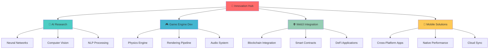

<!-- Dynamic Header with Animation -->
<div align="center">
  
</div>

<!-- Animated Typing Effect -->
<h1 align="center">
  
</h1>

<!-- Interactive Profile Views Counter -->
<p align="center">
  
  
  
</p>

<!-- Animated Separator -->


<!-- About Me Section with Cards -->
<table align="center">
<tr>
<td width="50%">

## 🎯 الهوية الرقمية | Digital Identity

```yaml
name: "Dinho | دينهو"
location: "Morocco 🇲🇦"
languages: 
  - العربية الدارجة (Native)
  - Français (Fluent) 
  - English (Advanced)
role: "Full-Stack Architect"
passion: "Building Tomorrow's Tech Today"
motto: "Code with Purpose, Create with Passion"
availability: "Open for Collaboration"
```

### 🌟 Core Philosophy
> *"Every line of code is a brushstroke on the canvas of innovation"*

- 🧠 **Mindset**: Growth-oriented problem solver
- 🎨 **Approach**: Creative engineering solutions
- 🌍 **Vision**: Technology that serves humanity
- ⚡ **Energy**: Perpetually curious learner

</td>
<td width="50%">

## 🚀 Current Endeavors


### 🔥 Active Projects
- 🤖 **NeuroBot AI**: Advanced Discord bot with ML
- 🎮 **Shadow Engine**: Custom game engine in C++
- 🌐 **CyberMarket**: Full-stack e-commerce platform  
- 👁️ **VisionAI**: Computer vision applications
- 🎵 **HarmonyBot**: Multi-platform music streaming

### 🎯 Learning Queue
- 🦀 **Rust** for system-level performance
- ⚛️ **React Native** for mobile development  
- 🧠 **Deep Learning** with PyTorch
- ☁️ **Cloud Architecture** (AWS/GCP)

</td>
</tr>
</table>

<!-- Skills Matrix with Visual Enhancement -->


## 🛠️ Technical Arsenal | ترسانة تقنية

<details>
<summary>🎨 <b>Frontend Development</b></summary>
<br>
<p align="center">
  
</p>

**Mastery Level:**
```
HTML5/CSS3     ████████████████████ 100%
JavaScript ES6 ██████████████████░░  90%
React.js       ████████████████░░░░  80%
TypeScript     ██████████████░░░░░░  70%
Vue.js         ██████████░░░░░░░░░░  50%
```
</details>

<details>
<summary>⚙️ <b>Backend Development</b></summary>
<br>
<p align="center">
  
</p>

**Expertise Distribution:**
```
Python         ████████████████████ 100%
Flask/FastAPI  ██████████████████░░  90%
Node.js        ████████████████░░░░  80%
SQL Databases  ██████████████████░░  90%
MongoDB        ██████████████░░░░░░  70%
```
</details>

<details>
<summary>🤖 <b>AI & Machine Learning</b></summary>
<br>
<p align="center">
  
  
  
</p>

**AI Competencies:**
- 🧠 Natural Language Processing
- 👁️ Computer Vision & Image Recognition  
- 🎯 Predictive Analytics & ML Models
- 🤖 Chatbot Development & Conversational AI
- 📊 Data Science & Statistical Analysis
</details>

<details>
<summary>🎮 <b>Game Development</b></summary>
<br>
<p align="center">
  
</p>

**Game Dev Stack:**
- 🎮 **Godot Engine**: Advanced GDScript programming
- 🎯 **Unity**: C# scripting and 3D development
- 🎨 **Blender**: 3D modeling and animation
- 🔊 **Audio**: Implementation and dynamic soundscapes
- 🏗️ **Custom Engine**: Building from scratch in C++
</details>

<details>
<summary>🔧 <b>DevOps & Tools</b></summary>
<br>
<p align="center">
  
</p>

**Development Workflow:**
- 🐳 **Containerization**: Docker & Docker Compose
- 🔄 **Version Control**: Git workflows & CI/CD
- 🐧 **Systems**: Linux administration
- 🛠️ **IDE**: VS Code with custom extensions
- 🎨 **Design**: Figma for UI/UX prototyping
</details>

<!-- GitHub Statistics Dashboard -->


## 📊 GitHub Analytics Dashboard

<div align="center">
  
  
</div>

<div align="center">
  
  
</div>

### 🏆 Achievement Showcase
<div align="center">
  
</div>

<!-- Project Showcase with Interactive Cards -->


## 🌟 Featured Projects | مشاريع مميزة

<table>
<tr>
<td width="50%">

### 🎵 HarmonyBot - Advanced Music Experience
```python
class HarmonyBot:
    def __init__(self):
        self.platforms = ['Spotify', 'YouTube', 'SoundCloud']
        self.features = {
            'ai_recommendations': True,
            'playlist_sync': True,
            'voice_commands': True,
            'audio_effects': ['reverb', 'bass_boost', 'echo']
        }
    
    def get_stats(self):
        return {
            'servers': 500+,
            'daily_users': 10000+,
            'songs_played': 1000000+
        }
```

**🔧 Tech Stack:** Python, Discord.py, Spotify API, YouTube API, FFmpeg
**⭐ Features:** Multi-platform streaming, AI playlists, Real-time audio processing

</td>
<td width="50%">

### 🧠 NeuroChat - AI Conversation Engine
```javascript
const NeuroChat = {
    languages: ['Darija', 'English', 'Français'],
    capabilities: {
        sentiment_analysis: true,
        context_memory: '10k_tokens',
        personality_adaptation: true,
        multilingual_switching: true
    },
    
    async processMessage(input, context) {
        const analysis = await this.analyzeSentiment(input);
        const response = await this.generateResponse(
            input, context, analysis
        );
        return this.adaptPersonality(response);
    }
};
```

**🔧 Tech Stack:** Node.js, OpenAI API, NLP Libraries, MongoDB
**⭐ Features:** Context awareness, Emotional intelligence, Code generation

</td>
</tr>
<tr>
<td width="50%">

### 👻 Whispers in the Dark - Horror Game
```gdscript
extends Node3D
class_name HorrorController

@export var fear_intensity: float = 0.0
@export var psychological_elements: Array[String] = [
    "dynamic_lighting", "procedural_audio", 
    "adaptive_difficulty", "biometric_response"
]

func _ready():
    setup_atmospheric_engine()
    initialize_ai_director()
    
func create_tension():
    var fear_curve = create_exponential_curve()
    apply_psychological_pressure(fear_curve)
```

**🔧 Tech Stack:** Godot 4, GDScript, Blender, FMOD Audio
**⭐ Features:** Procedural horror, AI director, Biometric integration

</td>
<td width="50%">

### 🛒 CyberMarket - E-Commerce Platform
```python
from fastapi import FastAPI, Depends
from sqlalchemy.orm import Session

class CyberMarket:
    def __init__(self):
        self.features = {
            'real_time_inventory': True,
            'ai_recommendations': True,
            'multi_currency': True,
            'advanced_analytics': True,
            'mobile_api': True
        }
    
    async def process_order(self, order_data):
        # Real-time inventory check
        inventory = await self.check_inventory(order_data)
        # AI-powered fraud detection
        fraud_score = await self.detect_fraud(order_data)
        return await self.complete_transaction(order_data)
```

**🔧 Tech Stack:** FastAPI, PostgreSQL, Redis, Stripe API, Docker
**⭐ Features:** Real-time processing, AI recommendations, Multi-currency

</td>
</tr>
</table>

<!-- Advanced Metrics and Insights -->


## 📈 Development Insights & Metrics

<div align="center">

### ⚡ Coding Activity Heatmap


### 🎯 Weekly Development Breakdown
```text
🐍 Python          ████████████████████████████████████████  45.2%  18h 30m
🌐 JavaScript      ██████████████████████████████            32.1%  13h 15m  
🎮 GDScript        ████████████████                          16.7%   6h 45m
🎨 CSS/SCSS        ████████                                   8.0%   3h 20m
⚙️  Shell/Config    ████                                       4.0%   1h 40m
```

### 🏅 Contribution Streaks & Milestones
<table align="center">
<tr>
<td align="center">

<br><sub>Current Coding Streak</sub>
</td>
<td align="center">

<br><sub>Personal Best</sub>
</td>
<td align="center">

<br><sub>Code Contributions</sub>
</td>
<td align="center">

<br><sub>Projects Created</sub>
</td>
</tr>
</table>

</div>

<!-- Innovation & Learning Section -->


## 🚀 Innovation Lab | مختبر الابتكار

<div align="center">

### 🧪 Current Research & Development



### 🎯 2024-2025 Roadmap
- **Q1**: Launch custom game engine beta
- **Q2**: Release AI-powered development tools
- **Q3**: Open-source community contributions
- **Q4**: Advanced ML model implementations

</div>

<!-- Community & Networking -->


## 🌍 Community & Collaboration

<table align="center">
<tr>
<td align="center" width="25%">

<br>
<a href="https://discord.gg/WU6N3q2zXh">

</a>
<br><sub>Active Developer Community</sub>
</td>
<td align="center" width="25%">

<br>

<br><sub>Community Contributions</sub>
</td>
<td align="center" width="25%">

<br>

<br><sub>Helping New Developers</sub>
</td>
<td align="center" width="25%">

<br>

<br><sub>Knowledge Sharing</sub>
</td>
</tr>
</table>

### 🤝 Let's Connect & Collaborate

<p align="center">
  <a href="https://discord.gg/WU6N3q2zXh">
    
  </a>
  <a href="https://instagram.com/alianedit">
    
  </a>
  <a href="mailto:dinho.dev@gmail.com">
    
  </a>
  <a href="https://linkedin.com/in/dinho-dev">
    
  </a>
  <a href="https://twitter.com/dinho_dev">
    
  </a>
</p>

<!-- Fun Section with Personality -->


## 🎭 Fun Facts & Personality | شخصية و حقائق ممتعة

<table align="center">
<tr>
<td width="50%">

### 🌙 Coding Preferences
```json
{
  "optimal_coding_time": "22:00 - 03:00",
  "fuel": "☕ Coffee + 🫖 Moroccan Tea",
  "music": ["Lo-fi Hip Hop", "Synthwave", "Ambient"],
  "setup": {
    "os": "Arch Linux (btw)",
    "editor": "VS Code + Vim motions",
    "theme": "Tokyo Night Storm",
    "keyboard": "Mechanical (Cherry MX Blue)"
  }
}
```

### 🎮 Gaming & Interests
- 🎯 **Favorite Games**: Horror, Puzzle, Strategy
- 📚 **Reading**: Sci-fi novels & Tech documentation  
- 🎬 **Movies**: Cyberpunk, Thriller, Documentary
- 🏔️ **Travel**: Exploring Morocco's mountains & coasts

</td>
<td width="50%">

### 🧠 Learning Philosophy
> *"Every bug is a teacher, every feature is a student"*

```python
class DinhoMindset:
    def __init__(self):
        self.curiosity = float('inf')
        self.patience = "unlimited"
        self.creativity = "maximum"
    
    def approach_problem(self, challenge):
        steps = [
            "understand_deeply",
            "break_into_parts", 
            "explore_solutions",
            "implement_elegantly",
            "share_knowledge"
        ]
        return self.execute_with_passion(steps)
    
    def daily_routine(self):
        return [
            "☀️ Morning coffee + news",
            "💻 Deep work sessions", 
            "🤝 Community interaction",
            "📚 Learning new concepts",
            "🌙 Late night coding magic"
        ]
```

</td>
</tr>
</table>

### 🎨 Creative Outlets
<p align="center">
  
  
  
  
  
</p>

<!-- Inspiration Quote -->
<div align="center">
  
</div>

<!-- Support Section -->


## 💝 Support My Work | ادعم عملي

<p align="center">
  <a href="https://buymeacoffee.com/dinho">
    
  </a>
  <a href="https://ko-fi.com/dinho">
    
  </a>
  <a href="https://patreon.com/dinho_dev">
    
  </a>
</p>

<p align="center">
  <i>If my work has helped you or inspired your projects, consider supporting me! ❤️</i>
</p>

<!-- Footer with Animation -->
<div align="center">
  
</div>

<!-- Hidden Easter Egg -->
<!-- 
🎉 Congratulations! You found the hidden message! 
If you're reading this, you're probably a fellow developer who appreciates attention to detail.
Feel free to reach out - let's connect and build something amazing together! 
Code: GITHUB_EXPLORER_2024
-->

<p align="center">
  
  
  
</p>
