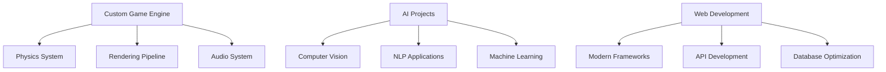

<p align="center">
  
</p>

<h1 align="center">
  
</h1>

<p align="center">
  
</p>

---

## 👤 من أنا؟

```yaml
Name: Dinho
Location: Morocco 🇲🇦
Languages: [Arabic, French, English]
Passion: Creating digital experiences that matter
Current Focus: AI Integration & Game Development
```

🚀 **What I do:**
- 🤖 **Discord Bot Developer** - Creating intelligent bots with advanced features
- 🌐 **Web Developer** - Building responsive applications with Flask, HTML/CSS, JavaScript
- 🧠 **AI Enthusiast** - Working with GPT, Computer Vision, and Machine Learning
- 🎮 **Game Developer** - Crafting horror and puzzle games using Godot Engine
- ⚡ **Engine Developer** - Building a custom game engine from scratch

---

## 🛠️ Tech Stack & Tools

<p align="center">
  
  <br>
  
  <br>
  
</p>

### 🔧 Programming Languages


### 🌐 Frameworks & Libraries


---

## 🔥 Featured Projects

### 🎵 Advanced Music Bot
```python
# Multi-platform music streaming with AI recommendations
features = [
    "Spotify & YouTube Integration",
    "Voice Channel Auto-Join",
    "Playlist Management",
    "Audio Filters & Effects",
    "Multi-language Support"
]
```

### 🧠 AI Multilingual Chatbot
```javascript
// Intelligent conversation in 3 languages
const languages = ['Darija', 'English', 'Français'];
const capabilities = ['Context Awareness', 'Sentiment Analysis', 'Custom Responses'];
```

### 👻 Horror Game Project
```gdscript
# Atmospheric horror experience built in Godot
extends Node

var fear_level = 0
var psychological_elements = ["Sound Design", "Lighting", "AI Behavior"]
```

### 🛒 E-Commerce Platform
```html
<!-- Full-stack web application -->
<features>
  <backend>Flask + SQLAlchemy</backend>
  <frontend>Responsive Design</frontend>
  <payment>Integrated Gateway</payment>
  <admin>Dashboard Panel</admin>
</features>
```

---

## 📊 GitHub Analytics

<p align="center">
  
  
</p>

<p align="center">
  
  
</p>

---

## 🏆 Achievements & Certifications

<p align="center">
  
</p>

- 🎯 **100+ Discord Bots** deployed and maintained
- 🌟 **Open Source Contributor** - Contributing to community projects
- 🎮 **Game Jam Participant** - Regular participant in game development competitions
- 🤖 **AI Integration Specialist** - Implementing ML models in web applications

---

## 🌟 Current Focus



---

## 🌐 Connect With Me

<p align="center">
  <a href="https://discord.gg/WU6N3q2zXh">
    
  </a>
  <a href="https://instagram.com/alianedit">
    
  </a>
  <a href="mailto:your.email@example.com">
    
  </a>
  <a href="https://linkedin.com/in/yourprofile">
    
  </a>
</p>

---

## 💡 Fun Facts

- 🌙 I code better at night (Team Night Owl!)
- ☕ Coffee consumption: `while(coding) { drink(coffee); }`
- 🎯 Currently learning: Rust and WebAssembly
- 🎵 Coding playlist: Lo-fi Hip Hop & Synthwave
- 🐧 Linux enthusiast & Open Source advocate

---

## 📈 Weekly Development Breakdown

```txt
Python       12 hrs 30 mins  ████████████░░░░░░░░░░░░░   50.2%
JavaScript    6 hrs 15 mins  ██████░░░░░░░░░░░░░░░░░░░   25.1%
GDScript      3 hrs 45 mins  ███░░░░░░░░░░░░░░░░░░░░░░   15.0%
HTML/CSS      1 hr 30 mins   █░░░░░░░░░░░░░░░░░░░░░░░░    6.0%
Other         55 mins        ░░░░░░░░░░░░░░░░░░░░░░░░░    3.7%
```

---

<p align="center">
  
  
</p>

---

<p align="center">
  
</p>

---

<p align="center">
  
</p>

<p align="center">
  <i>⚡ "Code is poetry written in logic" ⚡</i>
</p>
