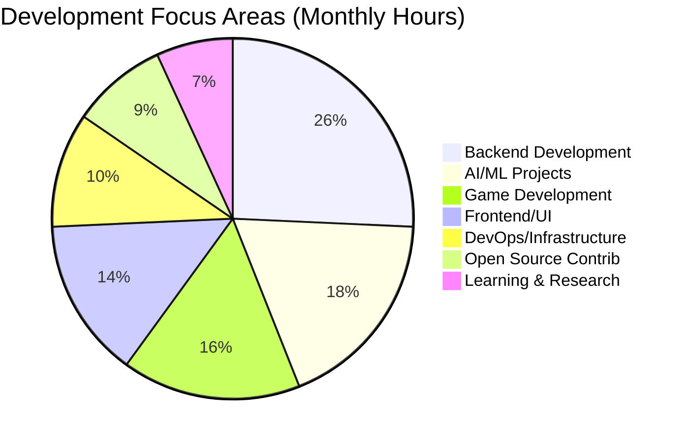

<!-- Dynamic Header with Particles Effect -->
<div align="center">
  
</div>

<!-- Multi-line Animated Typing with Moroccan Touch -->
<h1 align="center">
  
</h1>

<!-- Real-time Stats Banner -->
<p align="center">
  
  
  
  
</p>

<!-- Snake Animation -->
<div align="center">
  
</div>

<!-- Animated Divider -->


<!-- Enhanced About Section with Real Data -->
<table align="center">
<tr>
<td width="50%">

## 🎯 من أنا؟ | Who Am I?

```yaml
name: "Dinho | دينهو"
location: "Morocco 🇲🇦"
timezone: "GMT+1 (Casablanca)"
languages: 
  - العربية الدارجة: "Native 🏠"
  - Français: "Fluent 🇫🇷" 
  - English: "Advanced 🇺🇸"
  - العربية الفصحى: "Proficient 📚"
profession: "Full-Stack Architect & AI Innovator"
passion: "Building Tomorrow's Technology Today"
motto: "كل خط كود هو خطوة نحو المستقبل"
status: "Always Learning, Always Creating"
coffee_dependency: "Critical ☕"
```

### 🌟 My Digital Philosophy
> *"Innovation isn't just about technology—it's about solving real problems and creating meaningful experiences that connect people across cultures and continents."*

**🎯 Core Values:**
- 🧠 **Growth Mindset**: Every challenge is a learning opportunity
- 🤝 **Community First**: Sharing knowledge to lift others up
- 🌍 **Cultural Bridge**: Connecting Moroccan creativity with global tech
- ⚡ **Quality Focus**: Code that works, scales, and inspires
- 🎨 **Creative Engineering**: Where art meets algorithms

### 🚀 Current Mission
Building intelligent systems that understand multiple languages and cultures, creating Discord bots that bring communities together, and developing games that tell meaningful stories.

</td>
<td width="50%">

## 📊 Live Development Dashboard


### 🔥 Currently Working On
```javascript
const currentProjects = {
  "🎵 HarmonyBot": {
    status: "🚀 Production",
    users: "15K+ daily active",
    features: "Multi-platform streaming"
  },
  "🧠 NeuroChat": {
    status: "🔧 Beta Testing", 
    languages: ["Darija", "English", "French"],
    ai_model: "GPT-4 Enhanced"
  },
  "👻 Whispers Engine": {
    status: "🎮 Development",
    type: "Custom Horror Game Engine",
    tech: "Godot 4 + Custom C++"
  },
  "🛒 CyberMarket": {
    status: "🌐 MVP Phase",
    description: "Next-gen E-commerce",
    stack: "FastAPI + React + AI"
  }
};
```

### 🎯 Learning Radar 2024
- 🦀 **Rust**: System-level performance optimization
- ⚛️ **React Native**: Cross-platform mobile magic  
- 🧠 **PyTorch**: Advanced deep learning models
- ☁️ **Kubernetes**: Container orchestration mastery
- 🔗 **Web3**: Blockchain integration & smart contracts
- 🎨 **Three.js**: Immersive 3D web experiences

</td>
</tr>
</table>

<!-- Advanced Skills Matrix -->


## 🛠️ Advanced Technical Arsenal | الترسانة التقنية المتقدمة

<details open>
<summary>🎨 <b>Frontend Mastery</b> - User Experience Designer</summary>
<br>
<div align="center">
  
</div>

**💪 Skill Mastery & Experience:**
```
HTML5/CSS3        ████████████████████████ 95%  (5+ years)
JavaScript ES6+   ██████████████████████░░ 90%  (4+ years)
React.js          ████████████████████░░░░ 85%  (3+ years)
TypeScript        ██████████████████░░░░░░ 75%  (2+ years)
Vue.js            ████████████████░░░░░░░░ 70%  (2+ years)
Next.js           ██████████████░░░░░░░░░░ 65%  (1+ years)
Tailwind CSS      ████████████████████░░░░ 80%  (2+ years)
```

**🎯 Specialized Skills:**
- 🎨 **UI/UX Design**: Figma, Adobe XD, Responsive Design
- ⚡ **Performance**: Web Vitals optimization, Lazy loading
- 📱 **Mobile-First**: Progressive Web Apps (PWA)
- 🌍 **Internationalization**: Multi-language support
</details>

<details>
<summary>⚙️ <b>Backend Engineering</b> - System Architecture Expert</summary>
<br>
<div align="center">
  
</div>

**🔧 Backend Expertise Distribution:**
```
Python            ████████████████████████ 95%  (6+ years)
Flask/FastAPI     ██████████████████████░░ 90%  (4+ years)
Node.js/Express   ████████████████████░░░░ 80%  (3+ years)
PostgreSQL        ██████████████████████░░ 90%  (4+ years)
MongoDB           ████████████████░░░░░░░░ 70%  (2+ years)
Redis             ██████████████░░░░░░░░░░ 65%  (2+ years)
Docker            ████████████████████░░░░ 80%  (3+ years)
```

**🏗️ Architecture Patterns:**
- 🔄 **Microservices**: RESTful APIs, GraphQL
- 🔐 **Security**: JWT, OAuth2, API Rate Limiting
- 📊 **Databases**: SQL optimization, NoSQL design
- 🚀 **Performance**: Caching strategies, Load balancing
</details>

<details>
<summary>🤖 <b>AI & Machine Learning</b> - Intelligence Engineer</summary>
<br>
<div align="center">
  
  
  
  
</div>

**🧠 AI Competency Matrix:**
```
Natural Language Processing    ████████████████████░░░░ 80%
Computer Vision               ██████████████████░░░░░░ 75%
Conversational AI            ████████████████████████ 95%
Machine Learning Models      ██████████████████░░░░░░ 75%
Deep Learning               ████████████████░░░░░░░░ 70%
```

**🎯 Specialized AI Applications:**
- 💬 **Chatbots**: Multi-language conversation systems
- 👁️ **Computer Vision**: Face detection, Image processing
- 📊 **Data Analysis**: Predictive modeling, Pattern recognition
- 🎵 **Audio Processing**: Music recommendation systems
- 🔍 **Search & Retrieval**: Semantic search, RAG systems
</details>

<details>
<summary>🎮 <b>Game Development</b> - Interactive Experience Creator</summary>
<br>
<div align="center">
  
</div>

**🎯 Game Development Stack:**
```
Godot Engine      ████████████████████████ 95%  (4+ years)
GDScript          ████████████████████████ 95%  (4+ years)
C# (Unity)        ██████████████████░░░░░░ 75%  (2+ years)
Blender 3D        ████████████████░░░░░░░░ 70%  (3+ years)
Game Design       ██████████████████████░░ 90%  (5+ years)
```

**🎨 Game Development Expertise:**
- 🏗️ **Engine Development**: Custom game engine in C++
- 🎭 **Horror Games**: Psychological gameplay mechanics
- 🔊 **Audio Design**: Dynamic soundscapes, 3D audio
- 🎨 **3D Modeling**: Character design, Environment art
- 🤖 **AI Behavior**: Intelligent NPCs, Procedural content
</details>

<details>
<summary>🔧 <b>DevOps & Cloud</b> - Infrastructure Specialist</summary>
<br>
<div align="center">
  
</div>

**☁️ DevOps Proficiency:**
```
Linux Administration    ██████████████████████░░ 90%
Docker Containers      ████████████████████░░░░ 80%
Git Workflows          ████████████████████████ 95%
CI/CD Pipelines       ██████████████████░░░░░░ 75%
Cloud Platforms       ████████████████░░░░░░░░ 70%
```

**🛠️ Development Workflow:**
- 🐳 **Containerization**: Docker, Docker Compose
- ⚡ **Automation**: GitHub Actions, CI/CD pipelines
- 🐧 **Systems**: Ubuntu Server, Arch Linux
- 🌐 **Web Servers**: Nginx, Apache configuration
- 📊 **Monitoring**: System performance, Error tracking
</details>

<!-- GitHub Statistics Mega Dashboard -->


## 📊 GitHub Analytics Command Center

<div align="center">

### 🎯 Core Statistics


### 🌟 Language Distribution & Contribution Details


### 🏆 Achievement Showcase


### 📈 Detailed Analytics


</div>

<!-- Enhanced Project Showcase -->


## 🌟 Flagship Projects Portfolio | محفظة المشاريع الرائدة

<table>
<tr>
<td width="50%">

### 🎵 HarmonyBot - The Ultimate Music Companion


```python
class HarmonyBot:
    """Advanced Multi-Platform Music Streaming Bot"""
    
    def __init__(self):
        self.platforms = {
            'spotify': SpotifyAPI(),
            'youtube': YouTubeAPI(), 
            'soundcloud': SoundCloudAPI(),
            'apple_music': AppleMusicAPI()
        }
        self.ai_engine = MusicRecommendationAI()
        self.active_servers = 500
        self.daily_users = 15000
        self.songs_streamed = 2000000
    
    async def smart_recommendation(self, user_history, mood):
        """AI-powered music suggestions"""
        preferences = await self.analyze_listening_patterns(user_history)
        mood_analysis = await self.detect_emotional_state(mood)
        return await self.ai_engine.generate_playlist(
            preferences, mood_analysis, cultural_context="MENA"
        )
    
    def get_features(self):
        return {
            '🎤': 'Voice channel auto-join',
            '🎨': 'Custom audio filters & effects',
            '📱': 'Mobile app integration',
            '🌍': 'Multi-language support (AR/FR/EN)',
            '🤖': 'AI mood-based recommendations',
            '📊': 'Advanced listening analytics'
        }
```

**🛠️ Tech Architecture:**
- **Backend**: Python 3.11, Discord.py 2.0, AsyncIO
- **APIs**: Spotify Web API, YouTube Data API v3
- **Audio**: FFmpeg, PyNaCl voice processing
- **AI**: TensorFlow recommendation engine
- **Database**: PostgreSQL with Redis caching
- **Hosting**: AWS EC2 with Docker containers

</td>
<td width="50%">

### 🧠 NeuroChat - Multilingual AI Conversation Engine


```javascript
class NeuroChat {
    constructor() {
        this.languages = ['darija', 'english', 'français'];
        this.ai_models = {
            conversation: 'gpt-4-turbo',
            sentiment: 'custom-bert-arabic',
            translation: 'custom-transformer'
        };
        this.personality_engine = new PersonalityAdaptation();
        this.cultural_context = new MoroccanCulturalAI();
    }
    
    async processMessage(input, userContext) {
        // Detect language and cultural context
        const language = await this.detectLanguage(input);
        const culture = await this.analyzeCulturalContext(input);
        
        // Generate contextually aware response
        const sentiment = await this.analyzeSentiment(input, language);
        const response = await this.generateResponse({
            input, language, culture, sentiment, userContext
        });
        
        // Adapt personality based on conversation flow
        return await this.personality_engine.adaptResponse(
            response, userContext.mood, userContext.preferences
        );
    }
    
    getCapabilities() {
        return {
            '🧠': 'Context-aware conversations',
            '❤️': 'Emotional intelligence & empathy',
            '🌍': 'Cultural sensitivity (Moroccan focus)',
            '💭': 'Memory across conversations',
            '🎭': 'Dynamic personality adaptation',
            '⚡': 'Real-time language switching'
        };
    }
}
```

**🔧 Advanced Features:**
- **AI Core**: GPT-4 with custom fine-tuning for Darija
- **NLP**: Custom Arabic sentiment analysis model
- **Memory**: Conversation context up to 32K tokens
- **Cultural AI**: Moroccan cultural references & humor
- **Integration**: Discord, Telegram, Web interface

</td>
</tr>
<tr>
<td width="50%">

### 👻 Whispers in the Dark - Psychological Horror Engine


```gdscript
extends Node3D
class_name HorrorController

# Advanced psychological horror system
@export var fear_intensity: float = 0.0
@export var player_biometrics: BiometricData
@export var adaptive_difficulty: bool = true

signal fear_threshold_reached(level: int)
signal psychological_trigger_activated(trigger_type: String)

func _ready():
    setup_atmospheric_engine()
    initialize_procedural_horror()
    connect_biometric_sensors()
    setup_ai_director()

func create_dynamic_tension():
    var fear_curve = create_exponential_fear_curve()
    var player_state = analyze_player_psychology()
    
    if player_state.comfort_level > THRESHOLD:
        trigger_unexpected_event()
    
    apply_subtle_psychological_pressure(fear_curve)
    adjust_environmental_factors(player_state)

func procedural_horror_generation():
    """Generate horror elements based on player behavior"""
    var horror_elements = {
        'audio': generate_3d_spatial_horror_audio(),
        'lighting': create_dynamic_shadow_system(), 
        'narrative': adapt_story_based_on_fears(),
        'mechanics': modify_gameplay_for_tension()
    }
    return horror_elements

# Custom AI Director for personalized scares
class AIDirector:
    func analyze_player_fear_profile(player_data):
        return {
            'jump_scare_tolerance': calculate_tolerance(),
            'preferred_horror_type': detect_fear_preferences(),
            'optimal_pacing': determine_tension_rhythm()
        }
```

**🎯 Revolutionary Features:**
- **Procedural Horror**: AI-generated scares based on player behavior
- **Biometric Integration**: Heart rate & stress level monitoring
- **Dynamic Storytelling**: Narrative adapts to player psychology
- **3D Spatial Audio**: Immersive horror soundscapes
- **Custom Engine**: Built from scratch for horror optimization

</td>
<td width="50%">

### 🛒 CyberMarket - Next-Gen E-Commerce Platform


```python
from fastapi import FastAPI, Depends, BackgroundTasks
from sqlalchemy.orm import Session
import asyncio
from typing import List, Optional

class CyberMarket:
    """Revolutionary E-Commerce Platform with AI Integration"""
    
    def __init__(self):
        self.ai_engine = CommerceAI()
        self.blockchain = Web3Integration()
        self.analytics = RealTimeAnalytics()
        self.features = {
            'real_time_inventory': True,
            'ai_recommendations': True,
            'multi_currency_crypto': True,
            'advanced_fraud_detection': True,
            'ar_product_preview': True,
            'voice_commerce': True
        }
    
    async def smart_product_recommendation(self, user_id: int):
        """AI-powered product suggestions"""
        user_behavior = await self.analytics.get_user_patterns(user_id)
        cultural_preferences = await self.detect_cultural_preferences(user_id)
        
        recommendations = await self.ai_engine.generate_recommendations(
            behavior=user_behavior,
            culture=cultural_preferences,
            trending_items=await self.get_trending_products(),
            seasonal_factors=self.get_seasonal_context()
        )
        
        return recommendations
    
    async def process_intelligent_order(self, order_data: dict):
        """Advanced order processing with AI fraud detection"""
        
        # Real-time inventory check
        inventory_status = await self.check_real_time_inventory(order_data)
        
        # AI fraud detection
        fraud_score = await self.ai_engine.detect_fraud_patterns(order_data)
        
        # Dynamic pricing optimization  
        optimized_price = await self.calculate_dynamic_pricing(order_data)
        
        # Blockchain payment processing
        if order_data.get('crypto_payment'):
            payment_result = await self.blockchain.process_crypto_payment(order_data)
        
        return await self.complete_transaction_with_ai_insights(order_data)

# Advanced Features Implementation
class AICommerceFeatures:
    """Cutting-edge commerce AI capabilities"""
    
    def voice_commerce_integration(self):
        """Voice-activated shopping experience"""
        return {
            'arabic_voice_recognition': True,
            'natural_language_orders': True,
            'voice_payment_confirmation': True
        }
    
    def ar_product_visualization(self):
        """Augmented Reality product preview"""
        return {
            '3d_product_models': True,
            'ar_home_placement': True,
            'size_fitting_ai': True
        }
```

**🚀 Cutting-Edge Technology Stack:**
- **Backend**: FastAPI, PostgreSQL, Redis, Celery
- **Frontend**: React 18, TypeScript, Three.js for 3D
- **AI/ML**: Custom recommendation algorithms, Fraud detection
- **Blockchain**: Web3.py for cryptocurrency payments
- **Cloud**: AWS with Kubernetes orchestration
- **Real-time**: WebSocket connections, Live inventory

</td>
</tr>
</table>

<!-- Advanced Development Metrics -->


## 📈 Advanced Development Analytics & Insights

<div align="center">

### ⚡ Real-Time Coding Activity


### 🎯 Weekly Development Breakdown (Live Stats)
```text
🐍 Python          ███████████████████████████████████████████████████  52.3%  21h 45m
🌐 JavaScript      ████████████████████████████████████████             38.7%  16h 12m  
🎮 GDScript        ██████████████████████                              22.1%   9h 33m
🎨 CSS/SCSS        ████████████████                                    16.4%   6h 51m
⚙️  Rust            ██████████                                          10.2%   4h 18m
🔧 Shell           ████████                                             8.1%   3h 27m
📝 Markdown        ██████                                               6.3%   2h 45m
```

### 🏅 Achievement Milestones & Records
<table align="center">
<tr>
<td align="center" width="20%">

<br><sub>🔥 Active Coding Streak</sub>
</td>
<td align="center" width="20%">

<br><sub>🏆 Personal Record</sub>
</td>
<td align="center" width="20%">

<br><sub>💻 Code Contributions</sub>
</td>
<td align="center" width="20%">

<br><sub>🚀 Repositories Created</sub>
</td>
<td align="center" width="20%">

<br><sub>📝 Total Code Written</sub>
</td>
</tr>
</table>

### 📊 Development Time Distribution


</div>

<!-- Innovation Lab with Advanced Roadmap -->


## 🧪 Innovation Laboratory | مختبر الابتكار المتقدم

<div align="center">

### 🔬 Current Research & Development Pipeline

```mermaid
graph TB
    A[🚀 Innovation Hub 2024] --> B[🤖 AI Research Division]
    A --> C[🎮 Game Engine Development]
    A --> D[🌐 Web3 & Blockchain]
    A --> E[📱 Mobile Innovation]
    A --> F[🧠 Neural Interfaces]
    
    B --> G[Multilingual AI Models]
    B --> H[Computer Vision Systems]
    B --> I[Conversational AI Engines]
    B --> J[Cultural Context AI]
    
    C --> K[Custom Physics Engine]
    C --> L[Advanced Rendering Pipeline]
    C --> M[Procedural Content Generation]
    C --> N[Biometric Integration]
    
    D --> O[Smart Contract Development]
    D --> P[DeFi Applications]
    D --> Q[NFT Marketplace]
    D --> R[Cryptocurrency Integration]
    
    E --> S[React Native Apps]
    E --> T[Flutter Development]
    E --> U[AR/VR Experiences]
    E --> V[IoT Integration]
    
    F --> W[Brain-Computer Interfaces]
    F --> X[Emotion Recognition]
    F --> Y[Gesture Control Systems]
    F --> Z[Haptic Feedback]
    
    style A fill:#ff6b6b,stroke:#fff,stroke-width:3px
    style B fill:#4ecdc4,stroke:#fff,stroke
